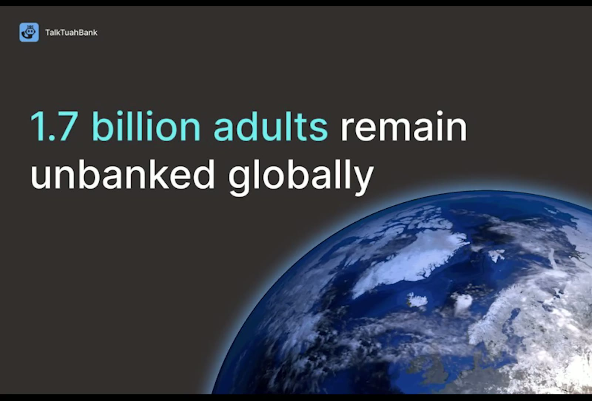
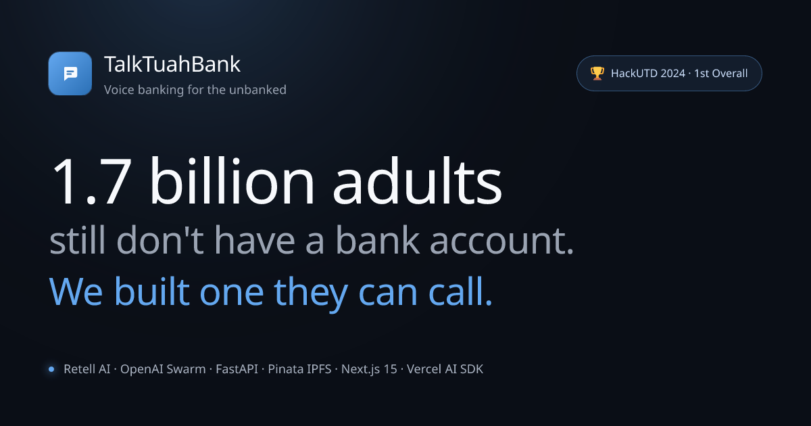
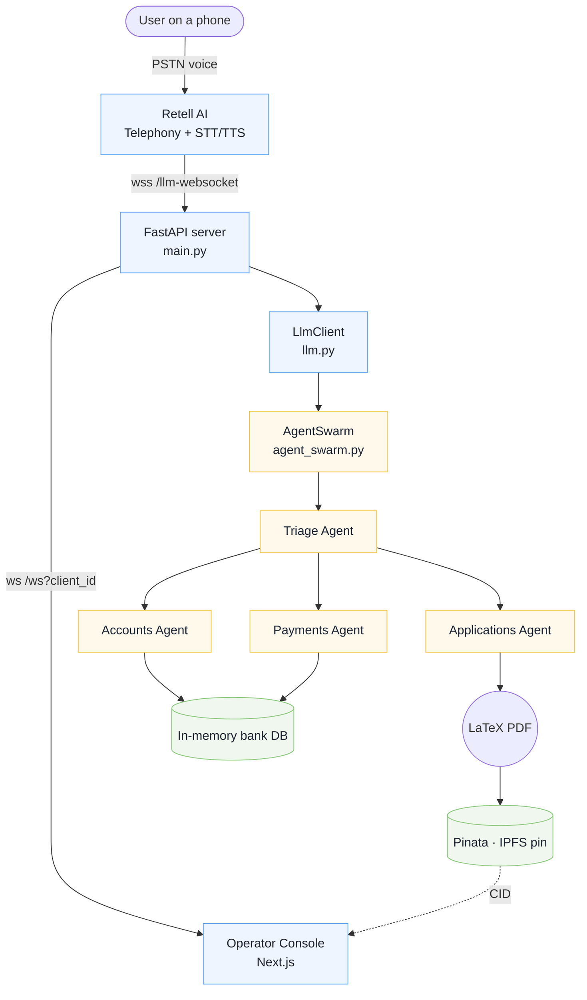
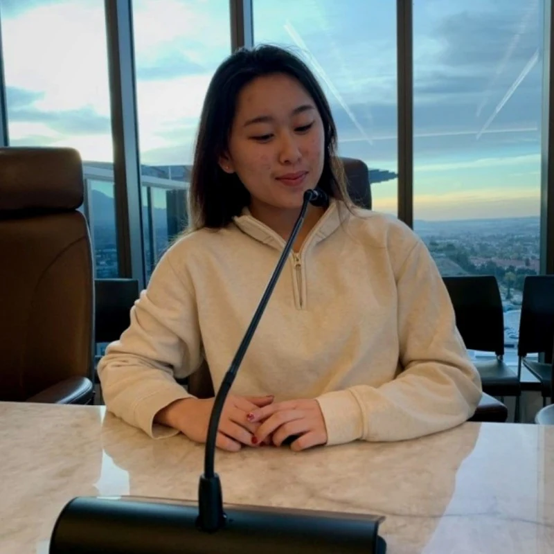
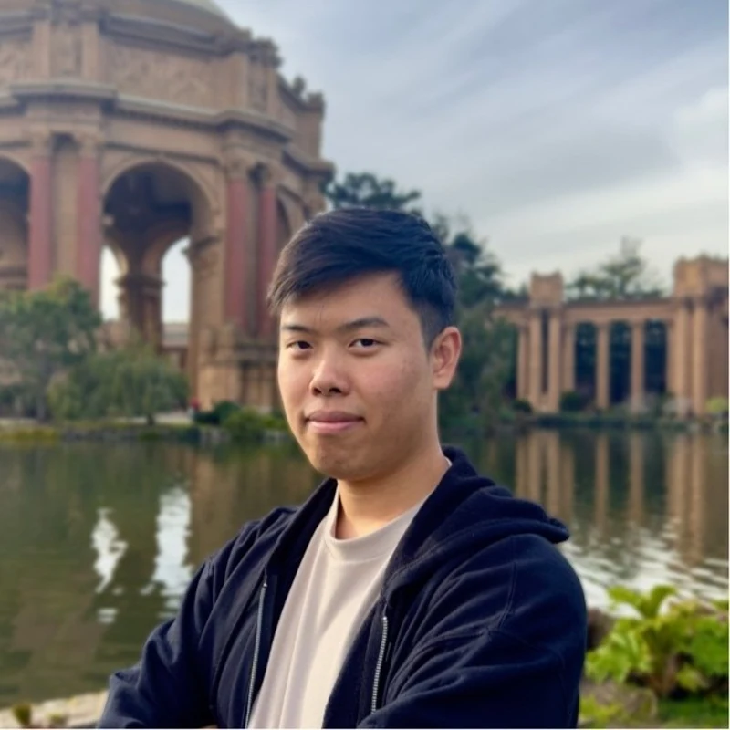

<div align="center">


# TalkTuahBank

### Voice banking for the 1.7&nbsp;billion adults without a bank account.

A multi-agent conversational AI that runs over a regular phone call &mdash; no internet, no smartphone, no banking app. Built in 24&nbsp;hours and crowned **Overall 1st Place** + **Goldman Sachs Track Winner** at HackUTD&nbsp;2024 across 1,100+&nbsp;hackers.

<br />

<a href="https://talktuah.art3m1s.me">
  
</a>
<a href="https://www.youtube.com/watch?v=YsH_z1azXSA">
  
</a>
<a href="https://devpost.com/software/talktuahbank">
  
</a>
<a href="https://github.com/aurelisajuan/TalkTuahBank">
  
</a>

<br /><br />


</div>

<br />

<div align="center">

<a href="https://talktuah.art3m1s.me">
  <video src="https://github.com/aurelisajuan/TalkTuahBank/raw/main/.github/assets/demo-clip.mp4" autoplay loop muted playsinline width="900" poster=".github/assets/demo-poster.jpg">
    
  </video>
</a>

<sub><em>A real phone call routes through Retell&nbsp;AI into a multi-agent FastAPI backend; the operator console reflects every event in real time. Click to watch the full 2&#8209;minute demo on YouTube.</em></sub>

</div>

<br />

> [!TIP]
> **The fastest way to understand this project is to open the live site.**
> The interactive walkthrough at <a href="https://talktuah.art3m1s.me/demo">talktuah.art3m1s.me/demo</a> replays the same multi-agent transcripts the FastAPI backend produced &mdash; no setup required &mdash; and an optional Live&nbsp;AI tab lets you talk to a real LLM running the same tool surface.

<br />

## Table of contents

- [The problem](#the-problem)
- [What we built](#what-we-built)
- [Architecture at a glance](#architecture-at-a-glance)
- [Tech stack](#tech-stack)
- [The deployed project page](#the-deployed-project-page)
- [Two demo modes](#two-demo-modes)
- [Quick start](#quick-start)
- [Repository layout](#repository-layout)
- [Team](#team)
- [HackUTD&nbsp;2024 &mdash; the weekend at a glance](#hackutd-2024--the-weekend-at-a-glance)
- [Acknowledgements](#acknowledgements)

<br />

## The problem

<table>
<tr>
<td width="55%">

Roughly **1.7&nbsp;billion adults** worldwide are still unbanked &mdash; not because they don't need financial services, but because the *interfaces* for those services have a price of admission they can't pay: a smartphone, an internet connection, a literacy threshold, a branch within walking distance.

Every modern fintech assumes one of those is solved.

We started TalkTuahBank from the opposite assumption: **the only thing the user has is a phone that can dial a number.** Build the entire bank around that constraint &mdash; voice in, voice out, identity verification by spoken digits, document delivery via a tamper-evident hash &mdash; and see how far you can get in 24&nbsp;hours.

</td>
<td width="45%" align="center">



</td>
</tr>
</table>

<br />

## What we built

A complete telephony banking flow with four LLM agents coordinating live during a single phone call.

<table>
<tr>
<td width="33%" valign="top">

#### Telephony, not chat
Inbound PSTN calls land in **Retell&nbsp;AI**, which streams transcript chunks over a bidirectional WebSocket to a FastAPI server. Replies stream straight back to the caller's ear via Retell's TTS.

</td>
<td width="34%" valign="top">

#### A swarm of focused agents
**Triage**, **Accounts**, **Payments**, and **Applications** &mdash; each with its own prompt and tool surface, coordinated via **OpenAI&nbsp;Swarm** handoff functions. The Triage agent decides *who* should answer; the others actually do the work.

</td>
<td width="33%" valign="top">

#### Tamper-evident artifacts
Loan and credit-card applications are rendered server-side with **LaTeX**, then pinned to **IPFS** through **Pinata**. The CID flows through to the operator console, so support can pull the exact PDF the caller signed off on.

</td>
</tr>
</table>

<br />

## Architecture at a glance



Or read the same diagram with annotated source excerpts on the live site:&nbsp;[**talktuah.art3m1s.me/architecture**](https://talktuah.art3m1s.me/architecture).

<br />

## Tech stack

<table>
<tr>
<td valign="top" width="33%">

#### Telephony &amp; AI
- **Retell&nbsp;AI** &mdash; PSTN, STT, TTS
- **OpenAI&nbsp;Swarm** &mdash; multi-agent handoffs
- **OpenAI&nbsp;Chat** &mdash; per-agent reasoning
- **Vercel&nbsp;AI&nbsp;SDK&nbsp;v6** &mdash; live demo tool loop
- **Vercel&nbsp;AI&nbsp;Gateway** &mdash; OIDC auth + routing

</td>
<td valign="top" width="33%">

#### Backend
- **FastAPI** &mdash; bidirectional WebSocket bridge
- **OpenAI Swarm** &mdash; agent orchestration
- **`pdflatex`** &mdash; server-side PDF rendering
- **Pinata** &mdash; pin-and-address PDFs to IPFS
- **In-memory ledger** &mdash; deterministic at hackathon time

</td>
<td valign="top" width="33%">

#### Project page
- **Next.js&nbsp;15** + **App Router**
- **React&nbsp;19** + **TypeScript**
- **Tailwind&nbsp;v4** with **OKLCH** tokens
- **shadcn/ui** + **Framer Motion**
- **Zustand** mirroring the FastAPI WS contract
- **Mermaid** rendered client-side

</td>
</tr>
</table>

<br />

## The deployed project page

The repo also ships with a full Next.js portfolio site in [`client/`](client/) that tells the project story end-to-end without spinning up the Python backend. It deploys as a single Vercel project and lives at [**talktuah.art3m1s.me**](https://talktuah.art3m1s.me).

| Route | What's there |
| --- | --- |
| [`/`](https://talktuah.art3m1s.me) | Hero, embedded demo reel, feature cards, hackathon stats, team |
| [`/demo`](https://talktuah.art3m1s.me/demo) | Interactive multi-agent walkthrough (Guided + optional Live AI) |
| [`/console`](https://talktuah.art3m1s.me/console) | The operator dashboard from HackUTD, wired to a session-local mock |
| [`/architecture`](https://talktuah.art3m1s.me/architecture) | Mermaid system diagram + annotated excerpts from `server/` |
| [`/build`](https://talktuah.art3m1s.me/build) | Stack rundown, 24-hour timeline, lessons learned, self-host instructions |

<br />

## Two demo modes

<table>
<tr>
<td width="50%" valign="top">

### 🎬 Guided Walkthrough
*Default · no API key required.*

Six pre-canned scenarios stream the same multi-agent transcripts the FastAPI backend produced &mdash; transfer funds, schedule a payment, cancel a payment, apply for a loan, apply for a credit card, check balance &mdash; with full handoff animations, in-memory ledger mutations, and fake Pinata IPFS hashes for every signed PDF.

100% client-side. Works offline. Always-on for recruiters.

</td>
<td width="50%" valign="top">

### 🎙️ Live AI
*Optional · enabled when `AI_GATEWAY_API_KEY` is set.*

A Next.js Route Handler at [`app/api/chat/route.ts`](client/src/app/api/chat/route.ts) runs the same six tools (`get_account_balance`, `transfer_funds`, `apply_for_loan`, &hellip;) against a real LLM via the **Vercel AI Gateway** using AI SDK v6 `streamText`.

Each request operates on an isolated, ephemeral clone of the bank ledger &mdash; the LLM cannot mutate state across sessions.

</td>
</tr>
</table>

<br />

## Quick start

<details>
<summary><strong>Run the deployable Next.js project page locally</strong></summary>

```bash
cd client
pnpm install
pnpm dev          # → http://localhost:3000
```

For the optional Live&nbsp;AI tab on Vercel:

- Enable the **Vercel AI Gateway** on the project (no plaintext `OPENAI_API_KEY` needed; the platform issues a short-lived OIDC token at deploy time)
- Optionally set `LIVE_AI_MODEL` to override the default model
- Build/install commands and `maxDuration` are wired in [`client/vercel.json`](client/vercel.json)

</details>

<details>
<summary><strong>Self-host the original FastAPI backend (telephony loop)</strong></summary>

```bash
# Terminal A — backend
cd server
pip install -r requirements.txt
export RETELL_API_KEY=...        # Retell telephony
export OPENAI_API_KEY=...        # OpenAI Swarm
export PINATA_API_KEY=...        # IPFS pinning
uvicorn main:app --reload --port 8000

# Terminal B — original operator console
cd client
pnpm install
pnpm dev
```

To re-bind the operator console to the live FastAPI socket, swap the Zustand mock in [`client/src/lib/store.ts`](client/src/lib/store.ts) for `new WebSocket("ws://localhost:8000/ws?client_id=…")` and pipe each parsed JSON message into `useDemoStore.getState().dispatchEvent(event)`. The event contract from `server/main.py` is preserved verbatim:

```ts
{ event: "combined_response", calls, db }
{ event: "db_response", data: db }
{ event: "calls_response", data: calls }
```

</details>

<br />

## Repository layout

<details>
<summary><strong>Show tree</strong></summary>

```text
TalkTuahBank/
├── client/                    Next.js 15 portfolio site (deployable)
│   ├── public/team/           Team headshots
│   ├── src/app/
│   │   ├── page.tsx           /        — hero, embedded demo, team
│   │   ├── demo/              /demo    — guided + live AI walkthrough
│   │   ├── console/           /console — operator dashboard (verbatim port)
│   │   ├── architecture/      /architecture — mermaid + annotated source
│   │   ├── build/             /build   — stack, timeline, lessons
│   │   ├── api/chat/          Live AI route (AI SDK v6 streamText)
│   │   ├── icon.svg           Favicon (chat bubble logo)
│   │   ├── apple-icon.tsx     Dynamic Apple touch icon
│   │   ├── opengraph-image.tsx Dynamic 1200×630 social card
│   │   └── manifest.ts        PWA manifest
│   └── src/lib/
│       ├── tools.ts           Bank tools as Zod-typed AI SDK tools
│       ├── mock-bank.ts       TS port of server/db.py
│       ├── mock-scenarios.ts  Scripted multi-agent transcripts
│       └── store.ts           Zustand store mirroring the FastAPI WS contract
├── server/                    Original Python backend (HackUTD build)
│   ├── main.py                FastAPI + bidirectional Retell WebSocket
│   ├── llm.py                 LlmClient bridge between Retell and Swarm
│   ├── agent_swarm.py         Triage / Accounts / Payments / Applications
│   ├── db.py                  In-memory bank ledger (5 seeded users)
│   └── pinata.py              IPFS pinning client
├── experiments/               Notebooks & prompt scratchpads
└── .github/assets/            README artwork
```

</details>

<br />

## Team

Three friends who showed up at ECSW with a hunch about voice and a list of bank-ledger ideas, and walked out with the overall trophy.

<table>
<tr>
  <td align="center" valign="top" width="33%">
    <a href="https://devpost.com/aurelisajuan">
      
      <br />
      <strong>Aurelisa Juan</strong>
    </a>
    <br />
    <sub>Voice agent design&nbsp;+&nbsp;product</sub>
    <br />
    <a href="https://github.com/aurelisajuan"></a>
  </td>
  <td align="center" valign="top" width="33%">
    <a href="https://devpost.com/IdkwhatImD0ing">
      
      <br />
      <strong>Bill Zhang</strong>
    </a>
    <br />
    <sub>Swarm&nbsp;+&nbsp;backend orchestration</sub>
    <br />
    <a href="https://github.com/IdkwhatImD0ing"></a>
  </td>
  <td align="center" valign="top" width="33%">
    <a href="https://devpost.com/NebuDev14">
      
      <br />
      <strong>Warren Yun</strong>
    </a>
    <br />
    <sub>Operator console&nbsp;+&nbsp;IPFS pipeline</sub>
    <br />
    <a href="https://github.com/NebuDev14"></a>
  </td>
</tr>
</table>

<br />

## HackUTD&nbsp;2024 &mdash; the weekend at a glance

<table>
<tr>
<td align="center"><strong>Event</strong><br /><sub>HackUTD&nbsp;2024 ·<br />Ripple&nbsp;Effect</sub></td>
<td align="center"><strong>Dates</strong><br /><sub>Nov&nbsp;16&ndash;17,&nbsp;2024</sub></td>
<td align="center"><strong>Venue</strong><br /><sub>ECSW · UT&nbsp;Dallas</sub></td>
<td align="center"><strong>Hackers</strong><br /><sub>1,100+</sub></td>
<td align="center"><strong>Prize pool</strong><br /><sub>$120,810</sub></td>
<td align="center"><strong>We won</strong><br /><sub>Overall&nbsp;1st&nbsp;Place&nbsp;+<br />Goldman&nbsp;Sachs Track</sub></td>
</tr>
</table>

<br />

> [!NOTE]
> **What's in this repo vs. what's running in production**
> The Python backend in [`server/`](server/) is unchanged from the HackUTD build &mdash; it still runs the live telephony loop. The Next.js project page in [`client/`](client/) is a post-hackathon rebuild that ports the operator dashboard, adds an interactive walkthrough, and replaces the old WebSocket connection with a session-local mock so the deployed site has zero infra dependencies. Re-binding to the real FastAPI socket is a one-line change in [`store.ts`](client/src/lib/store.ts).

<br />

## Acknowledgements

- **HackUTD&nbsp;2024 &middot; Ripple Effect** &mdash; for hosting the largest 24-hour hackathon in the United States and giving us the constraints that made this fun
- **Goldman Sachs** &mdash; for sponsoring the financial-services track and judging the project
- **Retell&nbsp;AI** &mdash; for telephony + STT/TTS that worked first try at 3am
- **OpenAI** &mdash; for the Swarm framework that made multi-agent handoffs feel almost obvious
- **Pinata** &mdash; for free IPFS pinning that survived the demo

<br />

<div align="center">

<sub>Built in&nbsp;24&nbsp;hours at&nbsp;HackUTD&nbsp;2024 &middot; Project page rebuilt with&nbsp;Next.js&nbsp;15 + Vercel&nbsp;AI&nbsp;SDK</sub>

<a href="https://talktuah.art3m1s.me">
  
</a>

</div>
